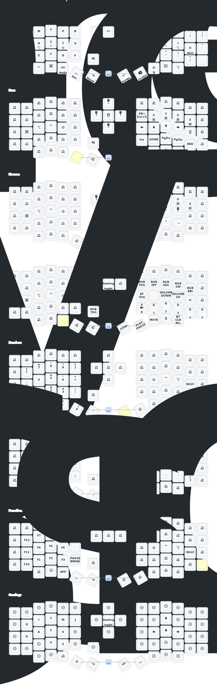

# ZMK Config - Eyelash Sofle

Personal ZMK firmware configuration for my Eyelash Sofle split keyboard.


## Hardware

- **Board**: Eyelash Sofle (nRF52840)
- **Left**: Rotary encoder
- **Right**: Analog joystick (pointing device)
- **Display**: Nice View

## Keymap



## Symbol Layer Design

The symbol layer is organized with mnemonic patterns for each hand:

```
┌────────────────────────────────────────────────────────────────────────────┐
│ LEFT HAND (Vim motions)             │ RIGHT HAND (Code constructs)         │
├─────┬─────┬─────┬─────┬─────┬───────┼─────┬─────┬─────┬─────┬─────┬────────┤
│  `  │  ?  │  #  │  ^  │  \  │       │  ~  │  {  │ <=  │ >=  │  }  │        │
│     │ ↑   │ ↑   │ ↑   │     │       │     │     │     │     │     │ BLOCKS │
├─────┼─────┼─────┼─────┼─────┼───────┼─────┼─────┼─────┼─────┼─────┼────────┤
│  !  │  ;  │  =  │  $  │  &  │       │  @  │  (  │  "  │  '  │  )  │        │
│ GUI │ ALT │CTRL │SHFT │     │       │     │SHFT │CTRL │ ALT │ GUI │ CALLS  │
├─────┼─────┼─────┼─────┼─────┼───────┼─────┼─────┼─────┼─────┼─────┼────────┤
│  +  │  /  │  *  │  %  │  |  │       │ ::  │  [  │  :  │  .  │  ]  │        │
│     │ ↓   │ ↓   │ ↓   │     │       │     │     │     │     │     │ ACCESS │
└─────┴─────┴─────┴─────┴─────┴───────┴─────┴─────┴─────┴─────┴─────┴────────┘
```

### Left Hand: Vim Motions (Vertical Pairs)

Physical key position matches logical direction in Vim:

| Column | Top (↑) | Home | Bottom (↓) | Purpose |
|--------|---------|------|------------|---------|
| 2 | `?` | `;` | `/` | Search backward/forward + repeat |
| 3 | `#` | `=` | `*` | Word search backward/forward |
| 4 | `^` | `$` | `%` | Line start / end / match pairs |

### Right Hand: Code Constructs (Row Categories)

| Row | Symbols | Use Case |
|-----|---------|----------|
| **Blocks** | `{ <= >= }` | Conditionals: `if x <= y { }` |
| **Calls** | `( " ' )` | Function calls: `func("str", 'c')` |
| **Access** | `[ : . ] ::` | Properties: `ns::arr[0].prop` |

## Building

Firmware builds automatically via GitHub Actions on push. Download artifacts from the [Actions tab](../../actions).

## Resources

- [ZMK Documentation](https://zmk.dev/docs)
- [Keymap Editor](https://nickcoutsos.github.io/keymap-editor/)
